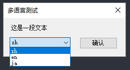
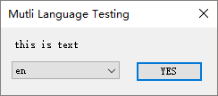

# winform-mutil-language-demo

本仓库是基于 .NET Framework 的 Winform 应用的多语言示例。





## Quick Start

- Visual Studio 2019
- .NET Framework 4.6.1

满足以上条件后，请直接加载 MutliLanguages.sln 解决方案并运行 WindowsFormsApp1.csproj 项目即可。

## And...

本示例包含以下特色：

1. 基于设计器的特定窗体本地化；

2. 基于 Resx 资源文件的公用资源本地化；

3. 利用 AppSettings 存储用户数据；

   ```c#
   Properties.Settings.Default.Language = culture;
   Properties.Settings.Default.Save();
   ```

4. 自动重新启动；

   ```c#
   DialogResult result = MessageBox.Show(
       text: LangResx.Common.DONE + LangResx.Common.RESTART_NOW, caption: "",
       buttons: MessageBoxButtons.YesNo, icon: MessageBoxIcon.Question);
   if (result == DialogResult.Yes)
   {
       Application.Restart();
   }
   ```

   

